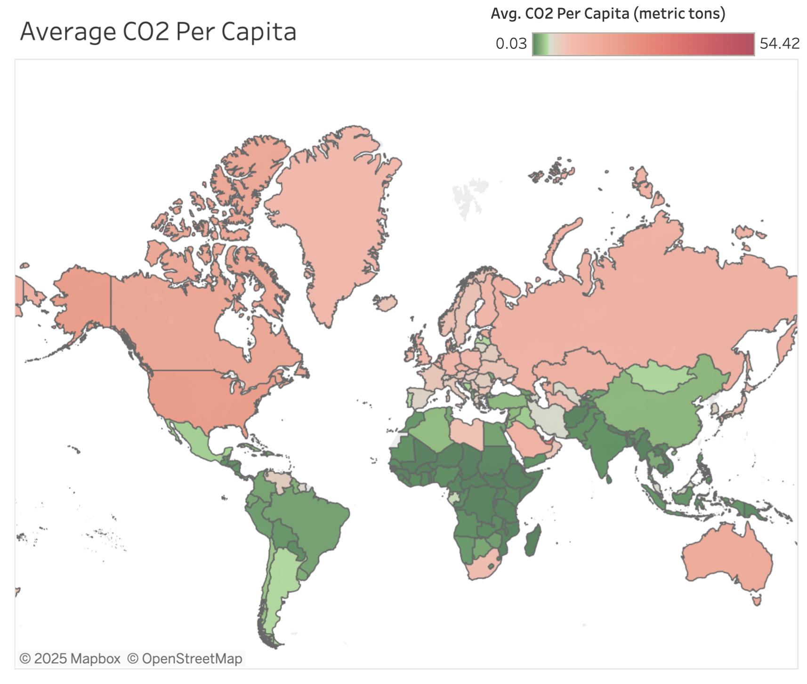
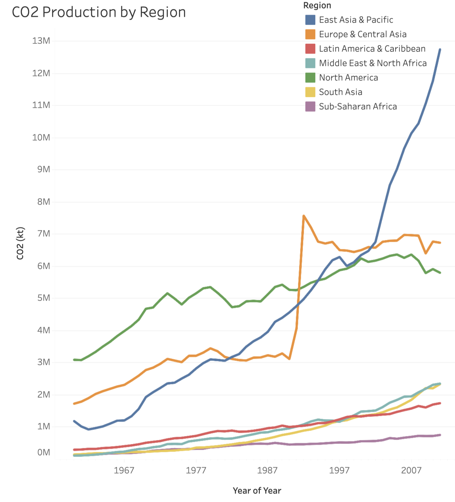

# **Global CO₂ Emissions Analysis**

### **Overview**

This project analyzes global CO₂ emissions data, focusing on **average CO₂ per capita** and **CO₂ production by region**.

🔗 **Live Dashboard:** [View on Tableau Public](https://public.tableau.com/app/profile/sunam.niroula/viz/DashboardsStarterTemplate_16648004340320/Dashboard1)

---

### **Screenshot Dashboard**

---

### **Key Features**

- **Average CO₂ per Capita** — Compare emissions on a per-person basis across regions.
- **CO₂ Production by Region** — Identify which regions contribute most to global emissions.
- **Interactive Filters** — Explore data by region, year, or category.
- **Clean, Minimal Dashboard Design** — Easy-to-read layout for quick insight extraction.

---

### **Visualization & Insights**

**Tools Used:** Tableau

- Created bar charts, maps, and KPIs to highlight trends.
- Showed **per-capita differences** to avoid bias from total population size.
- Allowed users to filter by region for detailed comparisons.

**Example Insight:**

> While total CO₂ emissions are highest in Asia, per-capita emissions are significantly higher in regions like North America, showing the difference between collective and individual environmental impact.

---

### **Skills Demonstrated**

- Data Visualization (Tableau)
- Dashboard Design & Storytelling
- Analytical Thinking

---

### **Files in this Repository**

- `CO2_production.twbx` — Tableau packaged workbook.
- `screenshot_dashboard.png`
  `screenshot_dashboard2.png`
  — Preview of the final dashboard.

---

**Author:** Sunam Niroula
Made by \[Sunam Niroula]
📧 [sunamniroula1@gmail.com](mailto:sunamniroula1@gmail.com)
🐙 GitHub: [Sunam Niroula](https://github.com/niroulasunam)
